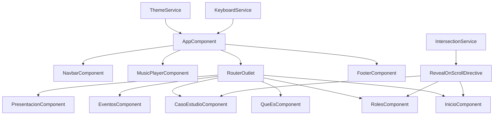

# Metodología Scrum - Guía Interactiva (Angular)

Migración a Angular 19 (standalone) de la guía interactiva de Scrum. Incluye routing con hash, estilos SCSS por componente y funcionalidades interactivas equivalentes al proyecto original.

## Requisitos

- Node.js 18+ (recomendado)
- npm 9+

## Ejecutar en desarrollo

```bash
npm install
npm start
```

Abre `http://localhost:4200/#/inicio`.

## Estructura principal

```
src/
  app/
    components/           # Componentes de la UI
    shared/               # Servicios y directivas compartidas
  assets/
    images/               # Imagenes del proyecto
    music/                # Pistas de musica
  styles.scss             # Variables y estilos globales
```

## Componentes

- `NavbarComponent`: navegacion principal y toggle de tema
- `ThemeToggleComponent`: modo claro/oscuro con persistencia
- `InicioComponent`: hero con tarjetas
- `QueEsComponent`: definicion de Scrum
- `RolesComponent`: roles con detalles expandibles
- `EventosComponent`: tabs de eventos
- `PresentacionComponent`: iframe de Canva
- `CasoEstudioComponent`: tabs del caso de estudio
- `MusicPlayerComponent`: reproductor con lista editable
- `FooterComponent`: pie de pagina

## Routing

Se usa hash routing para compatibilidad con hosting estatico:

- `#/inicio`
- `#/que-es`
- `#/roles`
- `#/eventos`
- `#/presentacion`
- `#/caso-estudio`

## Como funciona

### Flujo general

1. `AppComponent` renderiza el layout base (navbar, reproductor, contenido y footer).
2. El router carga el componente de la ruta activa.
3. Los estilos globales en `styles.scss` definen variables y layout.
4. Cada componente aplica su SCSS local.

### Servicios compartidos

- `ThemeService`: aplica `theme-dark` al body y guarda preferencia en `localStorage`.
- `KeyboardService`: escucha Alt+1..Alt+6 y navega por rutas.
- `IntersectionService` + `RevealOnScrollDirective`: activa animaciones al entrar en viewport.

### Interactividad por seccion

- `RolesComponent`: alterna detalles con estado local.
- `EventosComponent`: tabs controladas por `activeTab`.
- `CasoEstudioComponent`: tabs controladas por `activeTab`.
- `MusicPlayerComponent`: reproduce audio, filtra lista, acepta archivos locales y recuerda estado colapsado.

### Assets

Los recursos se sirven desde `src/assets` y se referencian con rutas relativas para compatibilidad con GitHub Pages.

## Build y despliegue

```bash
npm run build
```

El workflow de GitHub Pages publica el contenido generado en `dist/scrum-angular/browser`.

## Diagrama de flujo



## Notas

- La presentacion embebida de Canva requiere internet.
- Los assets se cargan desde `src/assets`.
- El reproductor permite cargar musica local sin subir archivos.
